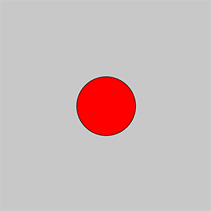
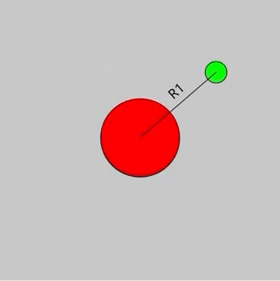
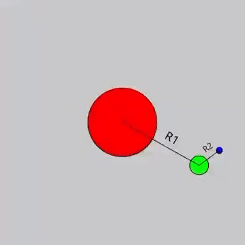

# Transition 

<font size="3">In this sketch, I utilize the concepts of rotate(), push(), and pop() to draw the sun, the earth, and the moon. Let us break this code down little by little.

First, let's simply draw a red circle to represent the sun. I locate the position of the sun in the middle of the canvas. 
```
function setup() {
  createCanvas(400, 400);
}

function draw() {
  background(200);

  //the sun
  push();
  translate(width/2,height/2);
  fill(255,0,0);
  ellipse(0,0,110,110);
  pop();
}
```
In this snippet of code, I utilize push() and pop() to keep my code **modular**, so that I can maintain a clean separation between different parts of my sketch. Any accumulative method used inside this block won't affect the outside. 

It looks like this:


---
Next, we need to draw the rotating earth. The earth's rotation center is the sun, so I utilize the translate() method to change the default rotation center from (0,0) to (width/2, height/2). 

Then, by adding the distance between the Earth and the sun (R1), I drew the Earth in a **relative location** (relative to the rotation center) which is (R1,0). Also, don't forget to increase the angle in each frame!

```
let angleEarth=0; //the rotation angle of the Earth
let R1=140; //the distance between the Earth and the sun

function setup() {
  ...
  angleMode(DEGREES);
}

function draw() {
  ...
  //changing the angle
  angleEarth+=0.3;

  //the Earth
  push();
  translate(width/2,height/2);
  rotate(angleEarth);
  fill(0,255,0);
  ellipse(R1,0,30,30);
  pop();
}
```
Now the sketch should look like this.



---
Moving on to drawing the moon, we notice that the moon is not only rotating around the Earth but also rotating around the sun. So, in this case, we need to draw the moon **inside** the Earth's block of code so that everything applied to the Earth will also be applied to the moon (namely Earth's rotation and Earth's translate). And since we already have the rotating effect around the sun and rotate() is an accumulative method, we only need to add a second rotate() to make the moon rotate around the Earth. Similarly, we can draw the moon in a **relative location** (relative to the rotation center) which is (R2,0).

The code should be like this:

```
  ...
let angleMoon=0 //the rotation angle of the moon
let R2=40; //the distance between the Earth and the moon

function draw() {
  ...
  
  //the Earth
  push();
  translate(width/2,height/2);
  rotate(angleEarth); //rotate around the sun
  fill(0,255,0);
  ellipse(R1,0,30,30);
  
  //the moon
  push();
  translate(R1,0); //change rotation center to the Earth
  rotate(angleMoon); //rotate around the Earth
  fill(0,0,255);
  ellipse(R2,0,10,10);
  pop();
  
  pop();
}

``` 

So, now two "rotate()" are applied to the moon, the first one allows it to rotate with the Earth around the sun, and the second one allows it to rotate around the Earth. 

And the sketch will look like this:



By putting three parts of code together we now have the simulation of the Earth moon sun system!

Below is a complete version of code:
```
let angleEarth=0; //the rotation angle of the Earth
let angleMoon=0 //the rotation angle of moon
let R1=140; //the distance between Earth and sun
let R2=40; //the distance between Earth and moon

function setup() {
  createCanvas(400, 400);
  angleMode(DEGREES);
}

function draw() {
  background(200);
  
  //changing the angle
  angleEarth+=0.3;
  angleMoon+=3;
  
  //the sun
  push();
  translate(width/2,height/2);
  fill(255,0,0);
  ellipse(0,0,110,110);
  pop();
  
  //the Earth
  push();
  translate(width/2,height/2);
  rotate(angleEarth);
  fill(0,255,0);
  ellipse(R1,0,30,30);
  
  //the moon
  push();
  translate(R1,0); 
  rotate(angleMoon);
  fill(0,0,255);
  ellipse(R2,0,10,10);
  pop();
  
  pop();
}
```

---

Some useful resources:

[The Coding Train: How to Rotate Shapes in p5.js ](https://www.youtube.com/watch?v=o9sgjuh-CBM)

[Moon In-class Code ](https://docs.google.com/document/d/1wVgNnDL-d_hH8ji6M8qRQM7UM7lOLXyWpolm_IP2edo/edit?usp=sharing)

[Cissy's Documentation Blog](https://wp.nyu.edu/cissyxie/category/creative-coding-lab/)

</font>


